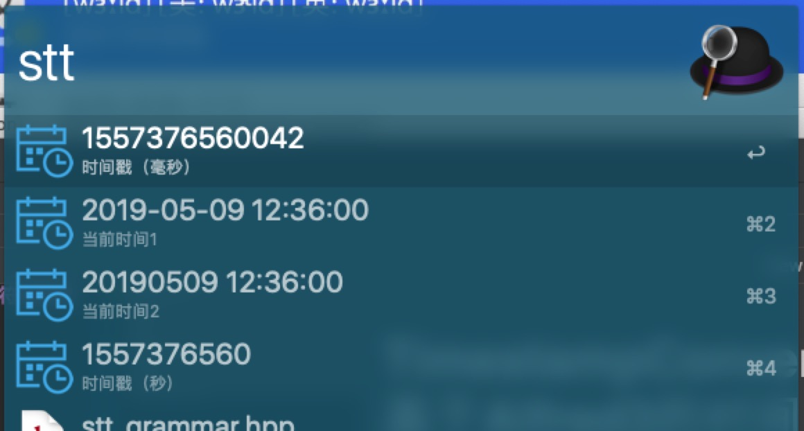
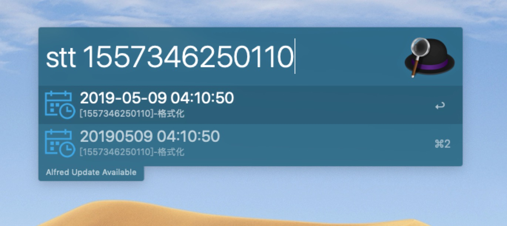
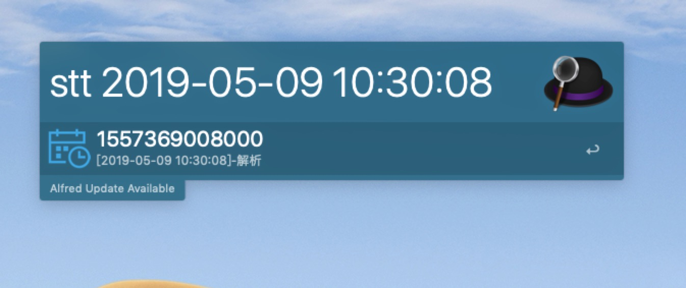

# TimestampConversion | 基于Alfred3的时间戳与时间字符串转换

---

## 简介

直接下载`Timestamp Tools.alfredworkflow`文件双击即可使用

或者有其它需求可以下载Python的源码，修改后再在新建的workflow所在的文件夹下面粘贴即可。

---

## 更新日志

- 2019-05-09 
  - 1.0版本代码初次上传

---

## 使用介绍

### 1. 默认情况

输入`stt`，即可看到当前时间的字符串形式和时间戳（毫秒和秒），在选项上回车即可复制结果

### 2. 时间戳转时间

输入`stt` + `时间戳（秒和毫秒均可识别）`，即会默认转换成`yyyy-MM-dd HH:mm:ss` 和`yyyyMMdd HH:mm:ss`两种时间格式的字符串

### 3. 时间转时间戳

输入`stt` + `时间字符串（指定格式）`，即会默认转换成毫秒时间戳形式

`yyyy-MM-dd HH:mm:ss`格式的例子

可识别的格式列表

- `yyyyMMdd HH:mm:ss`
- `yyyy-MM-dd %H:mm:ss`
- `yyyyMMdd %H:mm:ss`
- `yyyy/MM/dd %H:mm:ss`
- `yyyy.MM.dd %H:mm:`
- `yyyy-MM-dd`
- `yyyyMMdd`
- `yyyy/MM/dd`
- `yyyy.MM.dd`
 
---

## 使用的库和参考

1. alfred.py - https://github.com/nikipore/alfred-python